**INTRODUCTION**

In this hands-on security lab, I implemented real-world Linux system incidents to understand how misconfigurations and weak controls can lead to data loss, security risks, and operational failures. I created a multi-user environment and reproduced issues such as accidental file deletion, log overwriting, permission drift, deployment errors, and process anomalies. For each scenario, I analyzed the root cause and applied appropriate corrective and preventative controls using standard Linux tools

**SUMMARY OF THE TASKS**

**Scenario 1 – Shared Document Deletion Incident**

**Context**

An intern accidentally deleted a shared design document. Prevent this from happening again.

**Tasks**

**Part A – Multi-User Simulation**

● Create users: intern_a, dev_user, ops_user

I created three users using useradd	

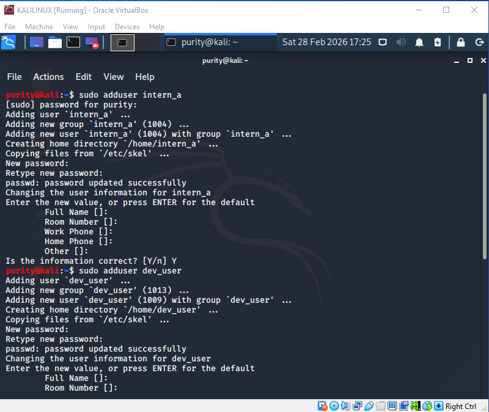

● Create group: project_team

I created a group for collaboration:

sudo groupadd project_team

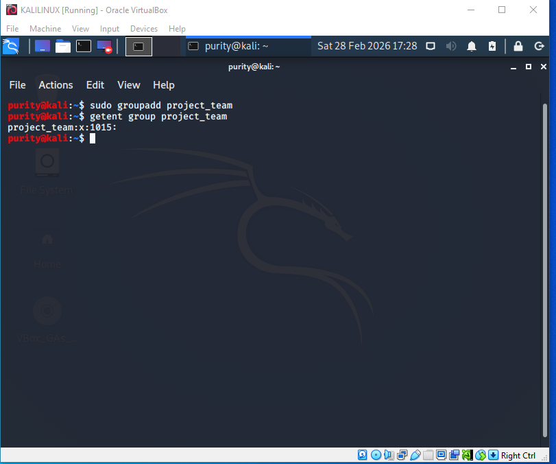

● Assign users to the group

sudo usermod -aG project_team intern_a

sudo usermod -aG project_team dev_user

sudo usermod -aG project_team ops_user

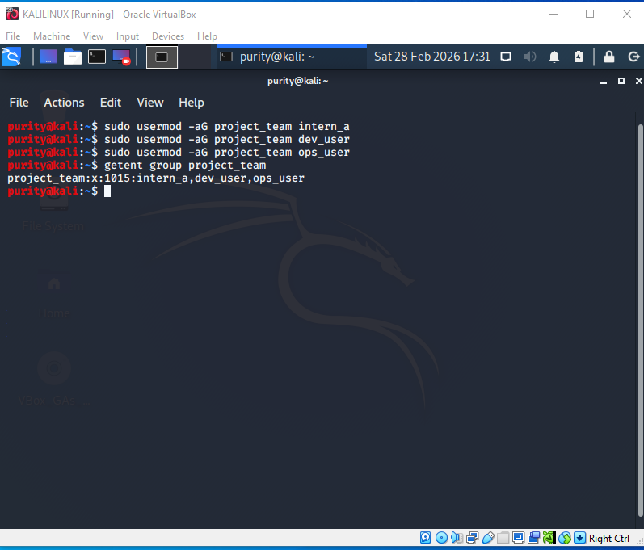

Group Membership Verification 

getent group project_team

This confirmed that all users were successfully added to the shared group.

**Explanation**

I created separate users to simulate role-based access in a real production environment. By grouping them under project_team, I ensured shared access to collaborative resources while maintaining individual user identities.

**Part B – Reproduce the Incident**

1.	Create a shared directory owned by project_team

sudo mkdir /shared_project

sudo chown :project_team /shared_project

sudo chmod 770 /shared_project

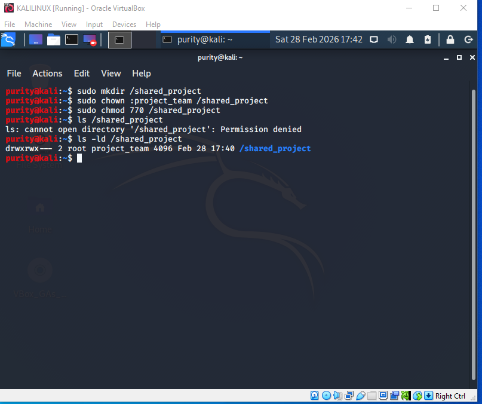

2.	Create file: shared_design.doc

sudo touch /shared_project/shared_design.doc

sudo chown :project_team /shared_project/shared_design.doc

sudo chmod 660 /shared_project/shared_design.doc

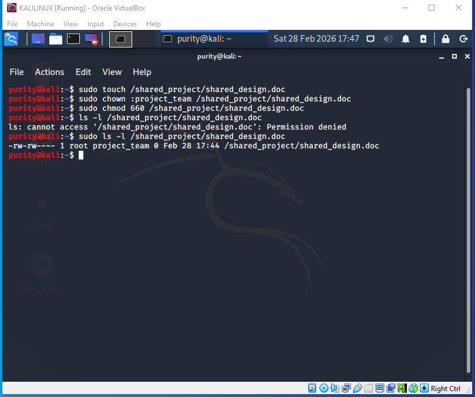

3.	Ensure group collaboration works

4.	Log in as intern_a

su - intern_a

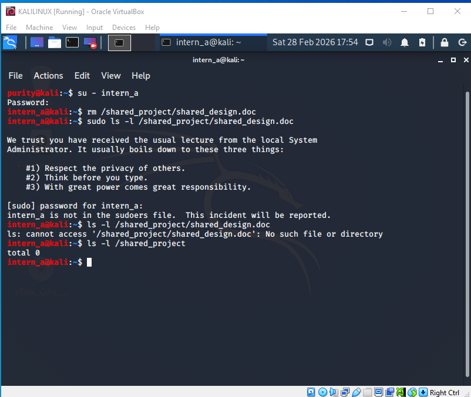

5.	Attempt to delete the file

rm /shared_project/shared_design.doc

The file was deleted because deletion in Linux is controlled by directory permissions, not file permissions. Since the directory had group write permissions (770), any member of the group could remove files inside it.

**Why Permissions Alone Were Insufficient**

Even though the file itself had restricted permissions (660), the directory allowed write access to the group. Write access on a directory permits file deletion. Therefore, traditional chmod-based permission controls were not enough to prevent accidental deletion.

**Part C – Prevent Recurrence**

1.	Recreate the file

sudo touch /shared_project/shared_design.doc

2.	Apply immutability/append-only protections (chattr +i, chattr +a)

sudo chattr +i /shared_project/shared_design.doc

3.	Log in as intern_a and attempt deletion

rm /shared_project/shared_design.doc

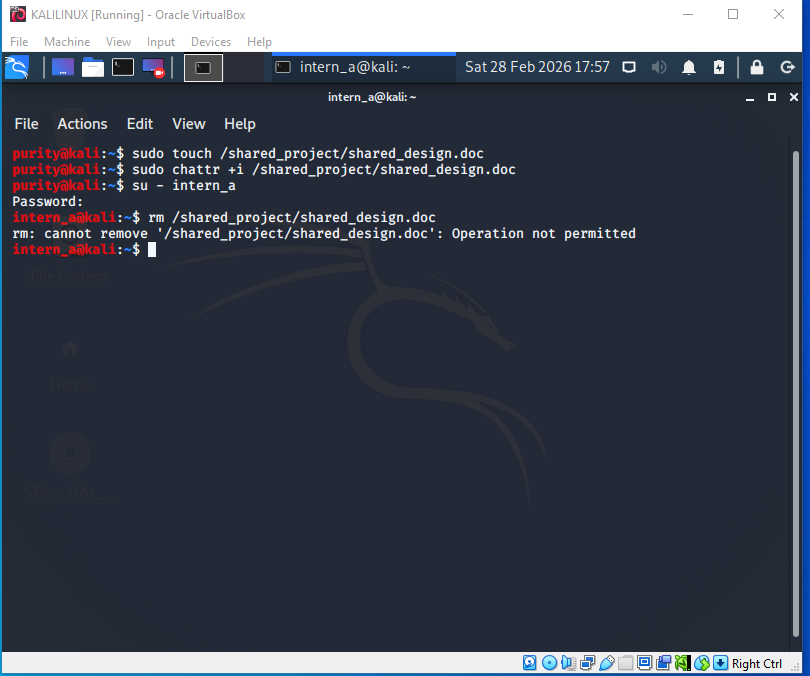

The deletion failed, even though directory permissions remained the same.This demonstrates that filesystem attributes provide stronger protection than standard permissions.

**Difference Between Attributes and Permissions**

**Permissions (chmod)**:

•	Control read, write, execute access

•	Based on user, group, others

•	Can allow deletion if directory is writable

**Attributes (chattr):**

•	Filesystem-level controls

•	Enforced by the kernel

•	Provide stronger protection

•	+i prevents modification and deletion

•	+a allows only appending

**Real Production Implications**

In production systems, relying solely on permissions can result in accidental deletion of shared documents, configuration files, or critical logs. To prevent this:

•	Immutable attributes should be applied where necessary

•	Version control systems should be used

•	Backup mechanisms should exist

•	Access control policies must be carefully designed

**Scenario 2 – Log Overwrite Incident**

**Context**

Application logs were overwritten, destroying forensic history.

**Tasks**

1.	Create logs/app.log with at least 100 lines

mkdir logs archive

for i in {1..100}; do echo "Log entry $i" >> logs/app.log; done

To view the file I used: cat logs/app.log

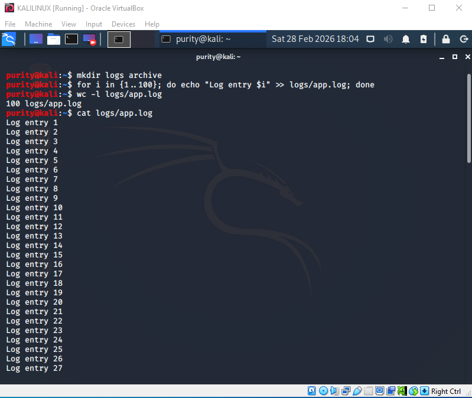

2.	Simulate accidental overwrite

echo "NEW LOG START" > logs/app.log

3.	Compare previous vs new line counts

wc -l logs/app.log

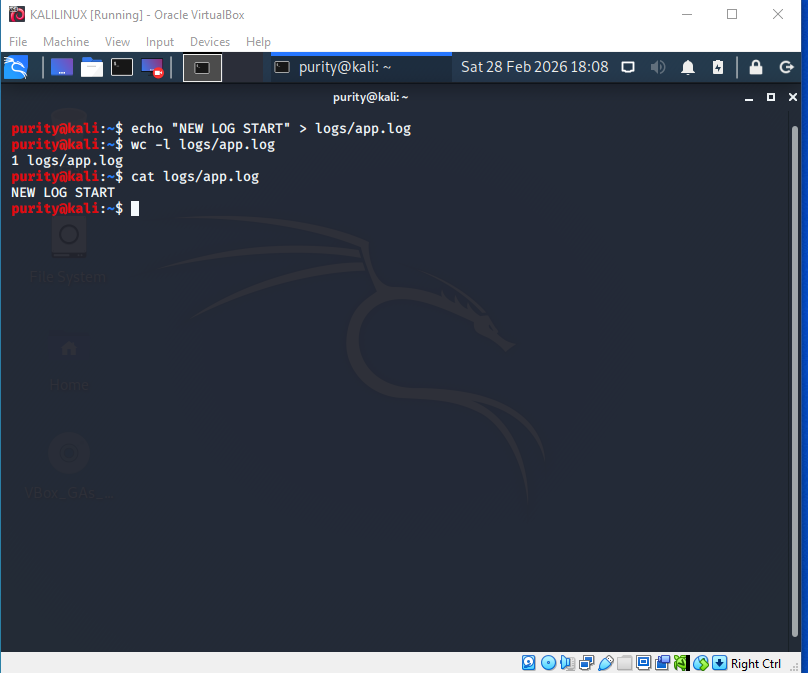

4.	Apply mechanism to prevent overwrite

sudo chattr +a logs/app.log

Attempting overwrite again:

echo "test" > logs/app.log

This failed.

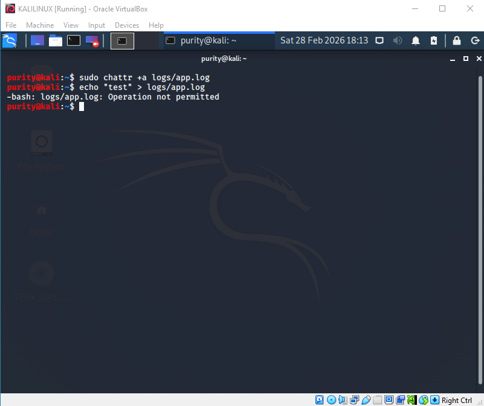

5.	Create backup in archive/ preserving timestamps and metadata

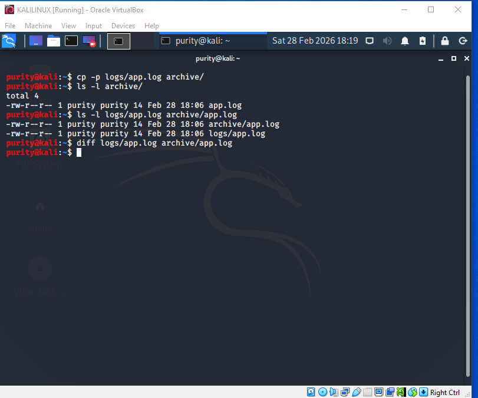

cp -p logs/app.log archive/

•  cp → copy a file

•  -p → preserve original file attributes

•  logs/app.log → source file

•  archive/ → destination directory

I checked both existence and attributes of the copied file  using  ls -l archive/ and ls -l logs/app.log archive/app.log

**Why Log Overwrites Are Dangerous**

Log overwrites destroy forensic evidence. Logs are essential for:

•	Security investigations

•	Compliance auditing

•	Incident response

•	Detecting unauthorized access

Once overwritten, historical data is lost permanently.

**Importance of Metadata Preservation**

Preserving metadata ensures:

•	Accurate timestamps

•	Correct ownership records

•	Reliable forensic timelines

Without metadata, investigations become unreliable.

**DevSecOps Forensic Significance**

In DevSecOps environments, logs are treated as evidence. Append-only configurations and proper backups protect the integrity of system activity records.

**Scenario 3 – Permission & Ownership Drift**

**Context**

Files copied across directories lose correct ownership and access.

**Tasks**

1. Create files with varying permissions

touch file1 file2

chmod 644 file1

chmod 777 file2

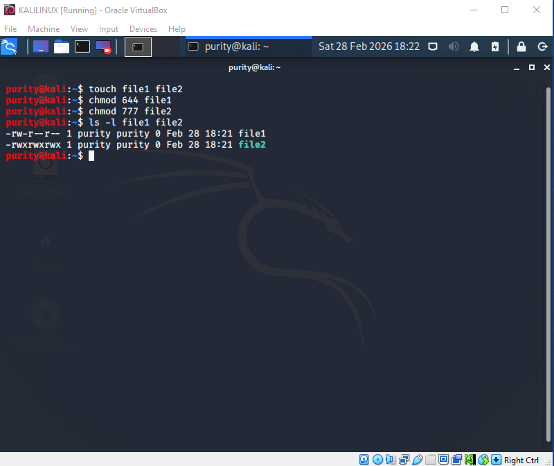

2. Change ownership and groups (chown, chgrp)

sudo chown dev_user file1

sudo chgrp project_team file2

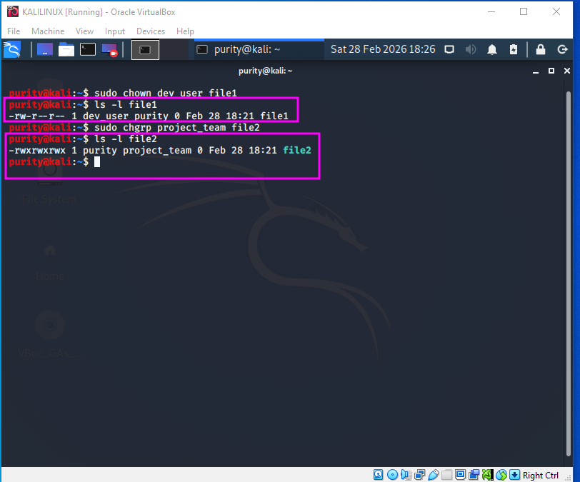

3.	Copy files with and without preservation flags (cp -p, cp -r)

**Copy With Preservation**

sudo cp -p file1 /home/

Ownership and timestamps were preserved.

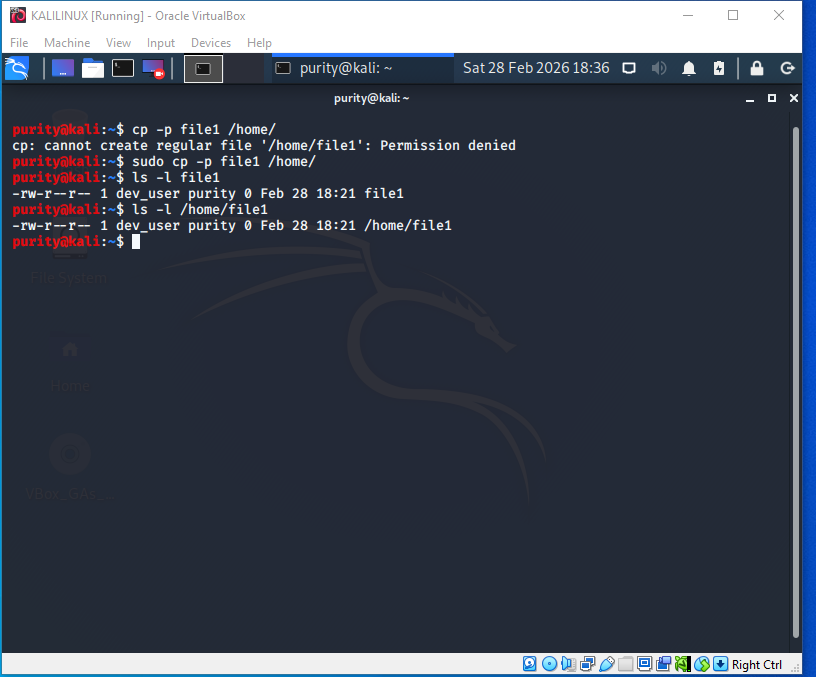

**Copy Without Preservation**

sudo cp file2 /home/

Since I didn’t use -p, ownership changed to the copying user.

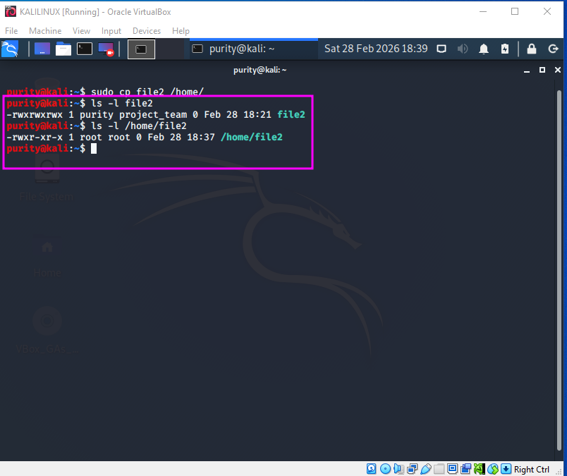

4.	Compare results

Without preservation flags, files inherit the identity of the copying user. This causes permission and ownership drift, which can break applications in production. Using cp -p or cp -a maintains consistency.

**Scenario 4 – Relative Path Deployment Failure**

**Context**

Deployment script copied incorrect data.

**Tasks**

1. created a script using relative paths

cd /home/purity

vi deploy_relative.sh

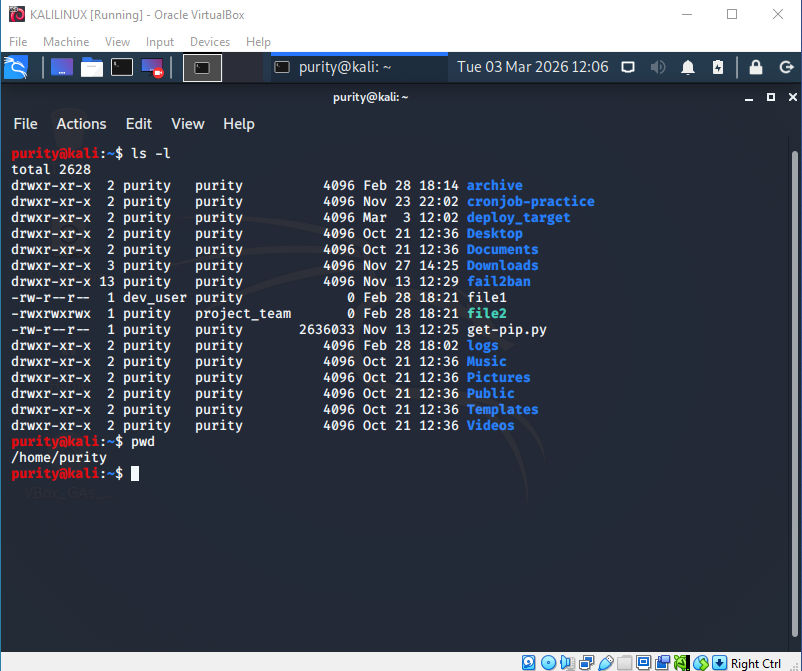

Inside vi, 
#!/bin/bash

I try to copy file1 using a relative path

cp file1 ../deploy_target/

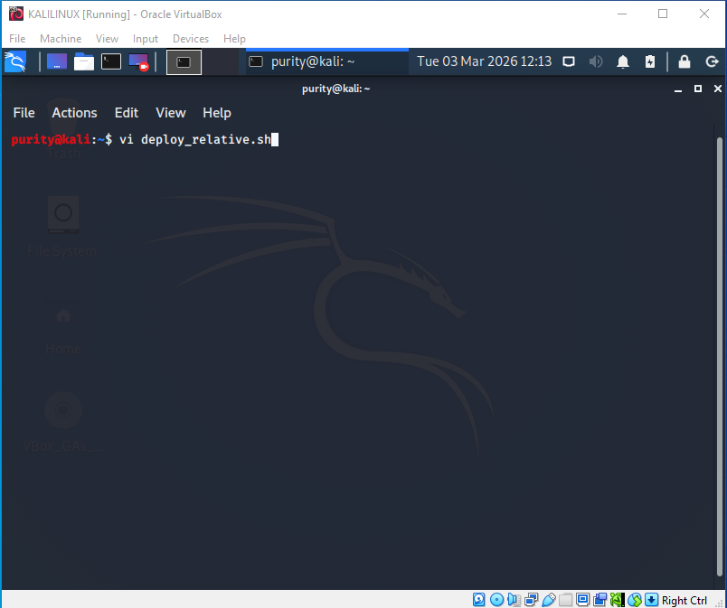

 I then made it executable:
 
chmod +x deploy_relative.sh

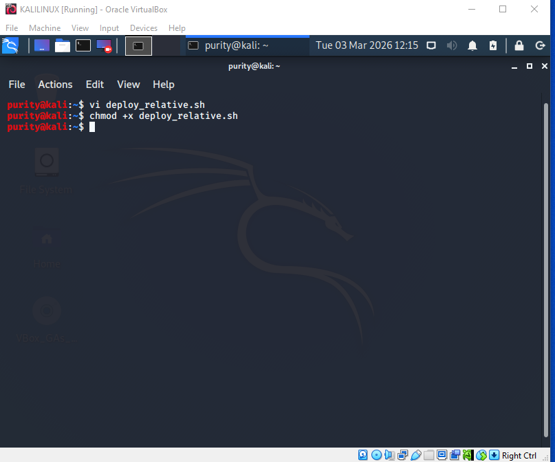

**Explanation:**

I created a script called deploy_relative.sh that tries to copy file1 using a relative path, which I know will fail if ../deploy_target does not exist.

2. Trigger deployment failure intentionally

./deploy_relative.sh

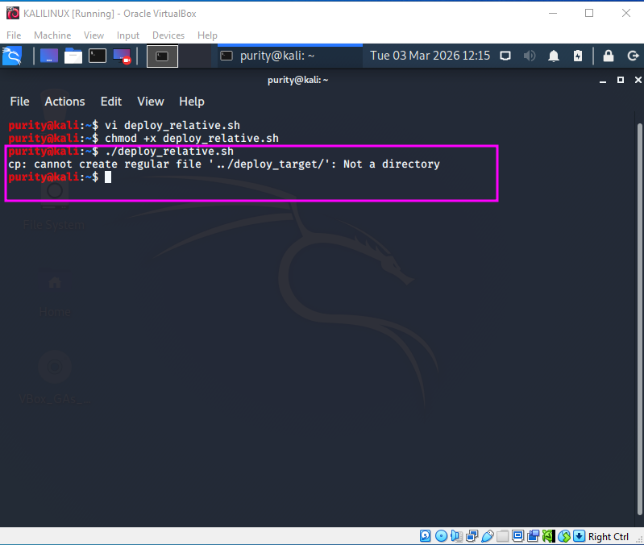

**Explanation:**

I run the script. It fails because ../deploy_target is outside /home/purity and doesn’t exist.

This simulates a deployment failure using a relative path.

3.	Correct using absolute paths

vi deploy_absolute.sh

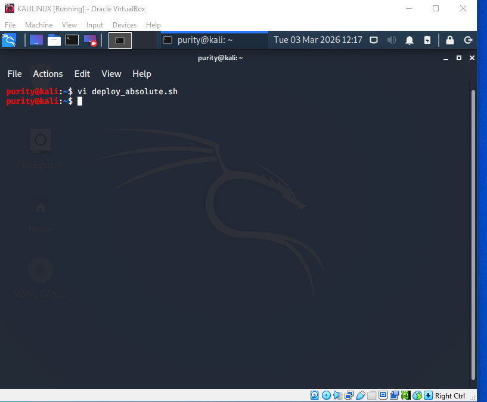

Inside vi, I press i and type:

#!/bin/bash

I copy file1 using an absolute path

cp /home/purity/file1 /home/purity/deploy_target/

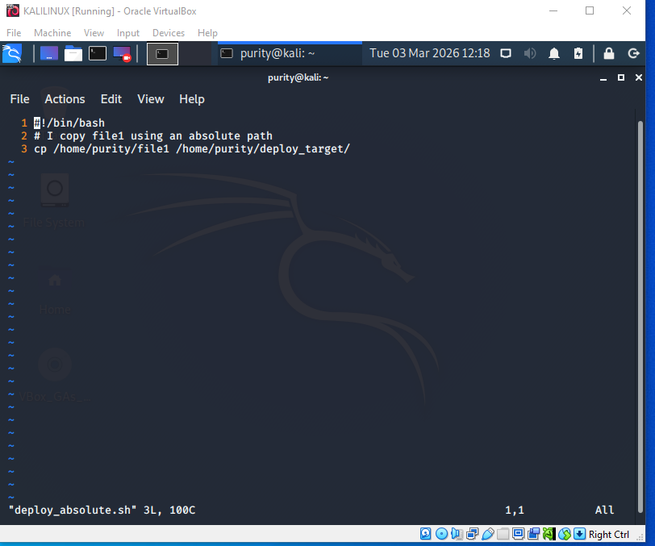

Then Esc, :wq, and press Enter to save.

Then made it executable:

chmod +x deploy_absolute.sh

 Then run it:
 
./deploy_absolute.sh

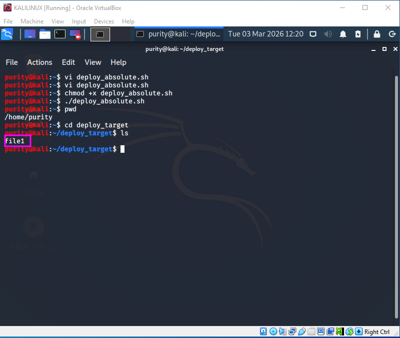

**Explanation:**

I now use the absolute path for file1 and the destination folder, so the copy works reliably inside /home/purity. Everything stays inside /home/purity and only uses file1.

Relative paths depend on the current working directory. In automated systems such as CI/CD pipelines or cron jobs, the working directory may vary. Absolute paths ensure predictable and reliable deployments. Relative paths caused issues because they depend on where I run the script. In my case, ../deploy_target/ points outside /home/purity, which doesn’t exist, so the copy fails. Using absolute paths avoids this problem because it always points to the correct location.

**Scenario 5 – Monitoring Failure After Log Cleanup**

**Context**

A log file was removed, causing monitoring failure.

**Tasks

I created a File

echo "Log entry" > app.log

ls -li app.log

the inode number and link count (should be 1).

1. Create hard link

ln app.log app_hard.log

ls -li

•	Both files share the same inode number

•	Link count becomes 2

•	Hard link = another filename pointing to the same inode (same data block)

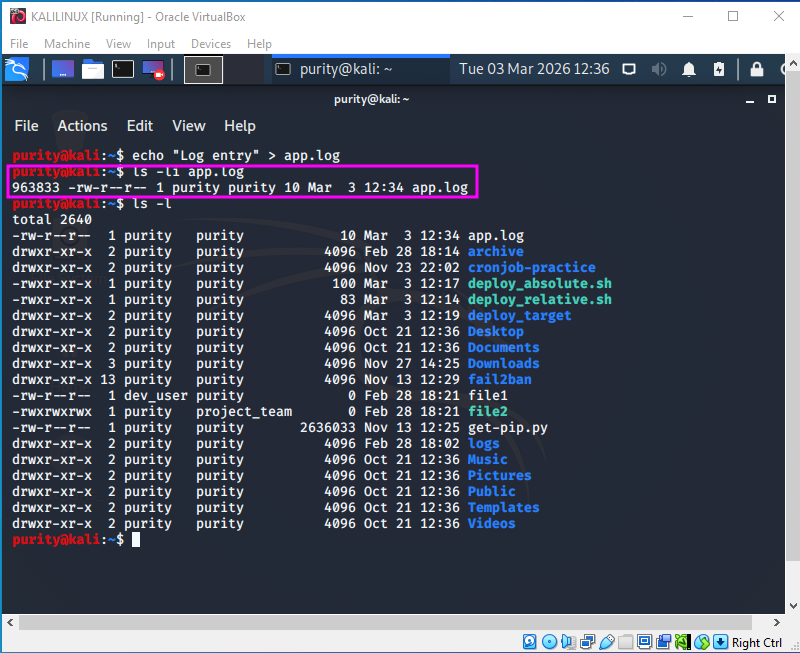

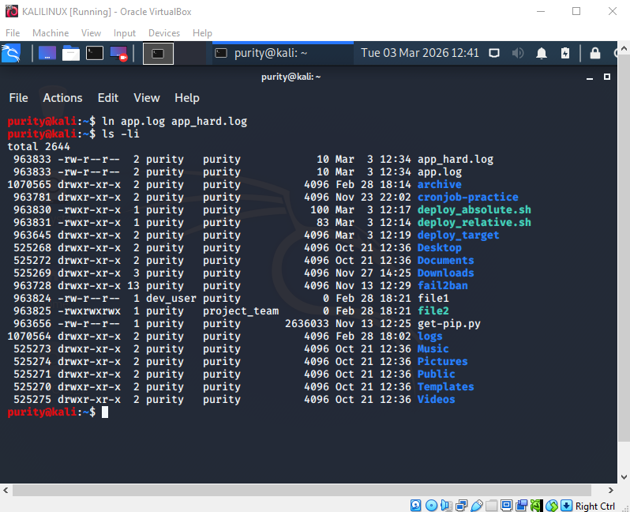

2. Create symbolic link

ln -s app.log app_soft.log

ls -li 

Symlink has a different inode
 
It stores the path to app.log, not the data

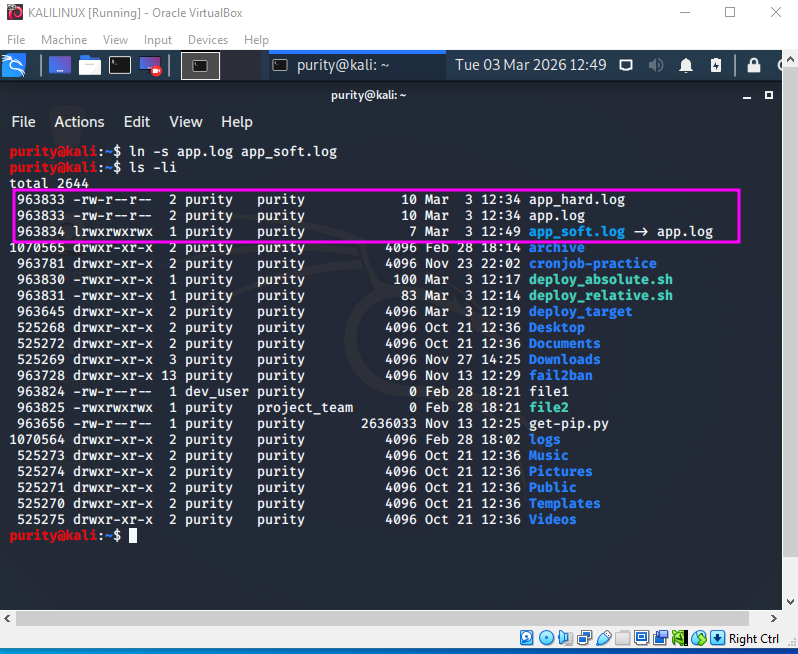

4.	Remove original file

rm app.log

ls –li

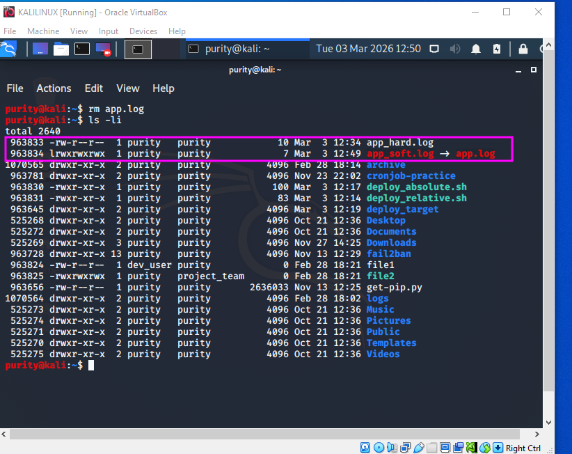

5.	Observe behavior differences

Hard Link Behavior

•	app_hard.log still works

•	Data is preserved

•	Link count decreases to 1

•	File is deleted only when link count = 0

Reason: Hard links point directly to the inode.

Symbolic Link Behavior

•	app_soft.log becomes broken

•	Accessing it gives “No such file or directory”

Reason: Symlink stores a filename path. When the original file is removed, the path no longer exists

Inode Behavior and Implications

An inode stores:

•	File metadata

•	Data block location

•	Permissions

•	Link count

A filename is just a reference to an inode.

•	Hard link → multiple filenames → same inode

•	Symbolic link → separate inode → stores path

Monitoring Failure Insight

If monitoring reads via:

•	Hard link → continues working

•	Symbolic link → fails after file deletion

This is why log cleanup using rm can break monitoring systems.

**Scenario 6 – Sensitive Data Exposure Hunt**

**Context**

Security team suspects secrets in logs/configs.

**Tasks**

1. Scan recursively using grep –r

grep -r "password" 

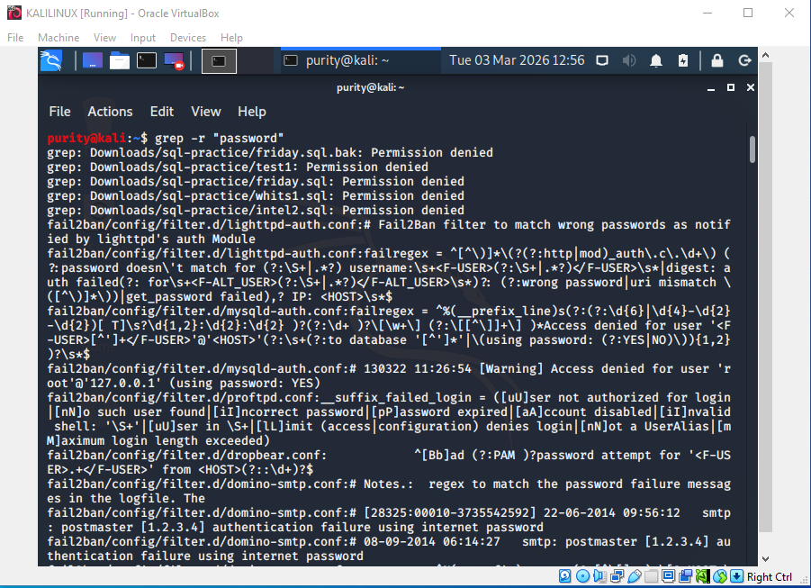

2. Use multiple expressions (-e)

grep -r -e "password" -e "secret" 

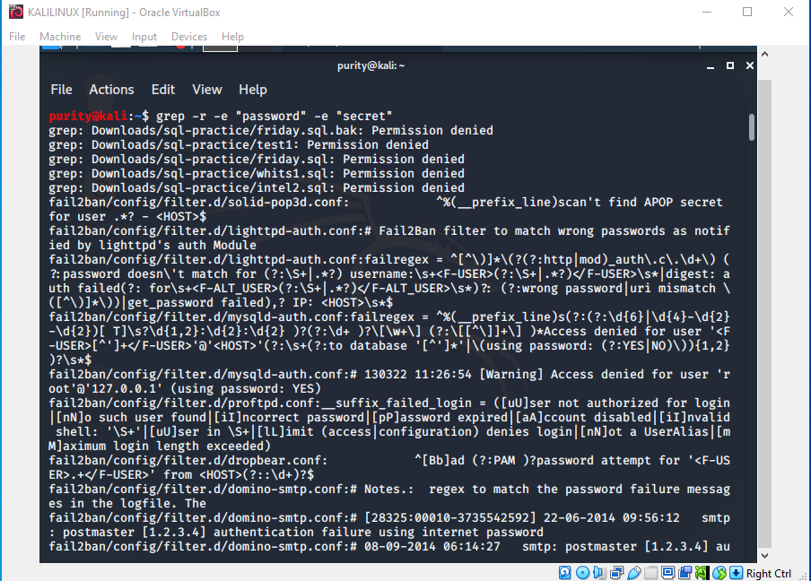

3. Use pattern file (-f)

echo "token" > patterns.txt

grep -r -f patterns.txt .

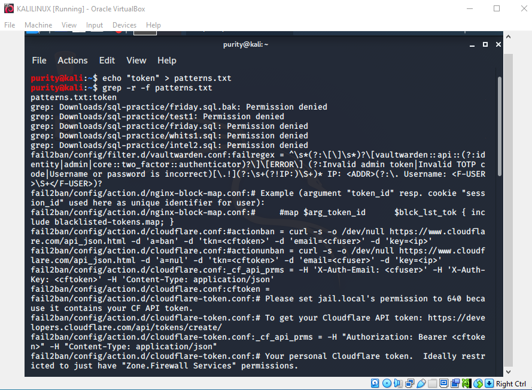

4. Store results using > and >>

grep -r "password" . > findings.txt

grep -r "secret" . >> findings.txt

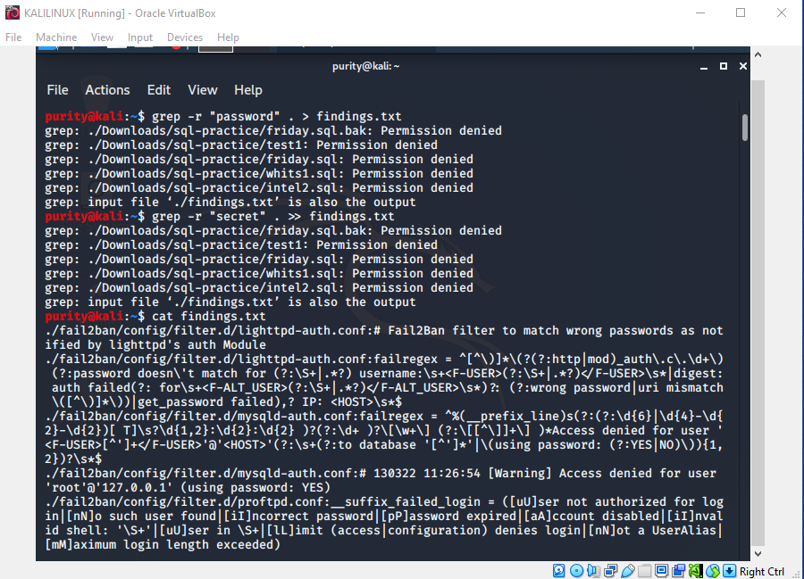

Why both redirection operators are used

The > operator overwrites a file.

The >> operator appends to a file.

I used > to create the initial findings report and >> to append additional results without deleting previous findings.

**Scenario 7 – Shared Directory Stability Controls**

**Context**

Developers report disappearing files.

**Tasks**

● Apply controls so:

○ File creation is allowed

○ Deletion of others’ files is prevented

Apply Sticky Bit

chmod +t /shared_project

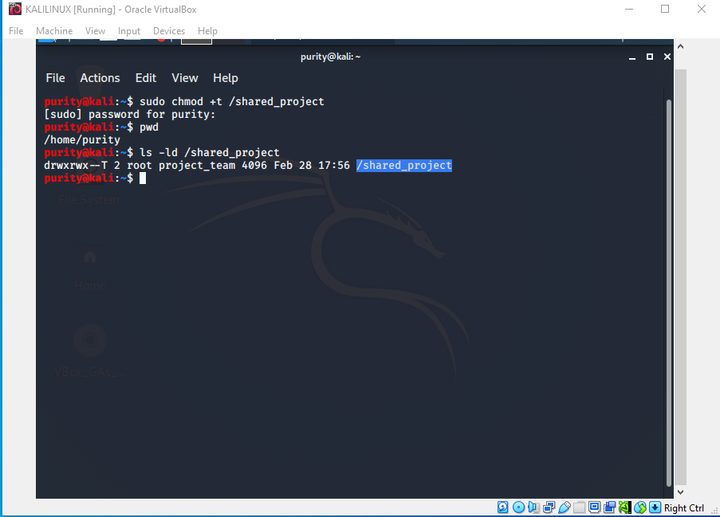

Explanation: Mechanism and security reasoning

With the sticky bit enabled:

•	Users can create files

•	Users cannot delete files owned by other users

Deletion is restricted to:

•	File owner

•	Directory owner

•	Root user

This prevents accidental deletion in shared directories.

T (uppercase) at the end → sticky bit is set, but “others” don’t have execute permission.

Because of the missing execute (x) for others, non-group users cannot enter the directory.

**Scenario 8 – Special Permission Risk Review

Context**

A script requires controlled privilege behavior.

**Tasks**

T**ask A – Sticky Bit on Shared Directory**

1. Inside:

~/company_projects/payments_platform/environments/production/services/api/shared/

I logged in as dev_user

su - dev_user

I created the full directory structure

mkdir -p ~/company_projects/payments_platform/environments/production/services/api/shared

mkdir -p ~/company_projects/payments_platform/environments/production/services/api/bin

I made sure the group is project_team (for setgid testing)

sudo chown -R dev_user:project_team ~/company_projects

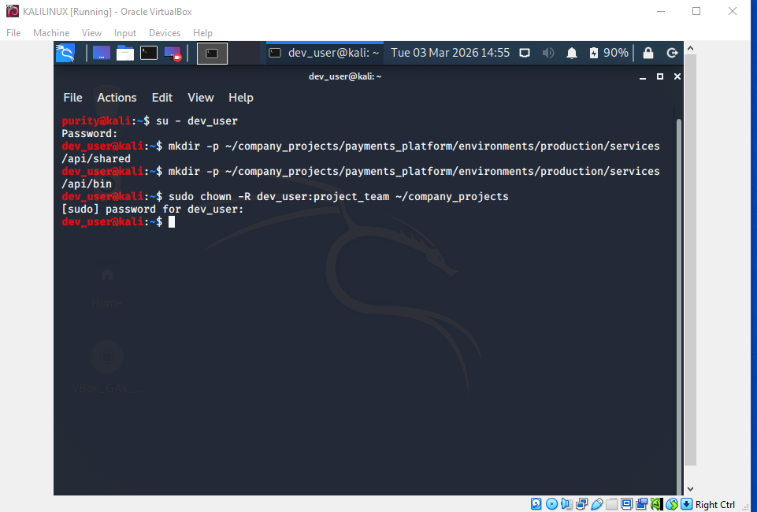

2. Log in as dev_user and create a file project_notes.txt.

3. Apply the sticky bit on the shared/ directory.

As dev_user, I create a file:

cd ~/company_projects/payments_platform/environments/production/services/api/shared

touch project_notes.txt

Apply sticky bit on the directory:

sudo chmod +t .

Verify sticky bit:

ls -ld .

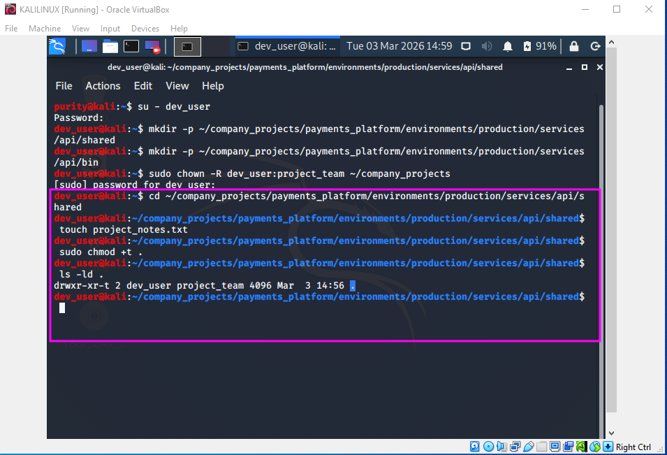

4. Log in as another user (e.g., intern_a) and attempt to delete the file created by

dev_user.

I switched to intern_a and attempt to delete the file:

su - intern_a

cd /home/dev_user/company_projects/payments_platform/environments/production/services/api/shared

rm project_notes.txt

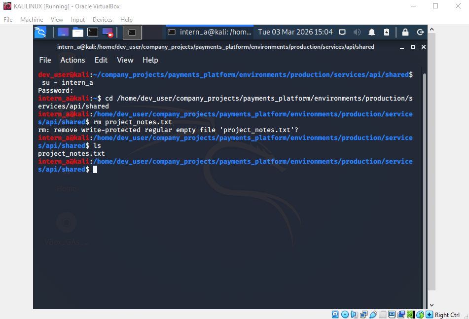

Task B – SetGID Demonstration

1.	Apply setgid on the same shared/ directory.

2. Inside shared/, create a subdirectory called:

shared/team_docs/

As dev_user, I apply setgid:

cd ~/company_projects/payments_platform/environments/production/services/api/shared

sudo chmod g+s .

I created a subdirectory:

mkdir team_docs

3. Log in as a different user (intern_a) and create:

○ A file inside team_docs/ (e.g., notes.txt)

○ A subdirectory inside team_docs/ (e.g., drafts/)

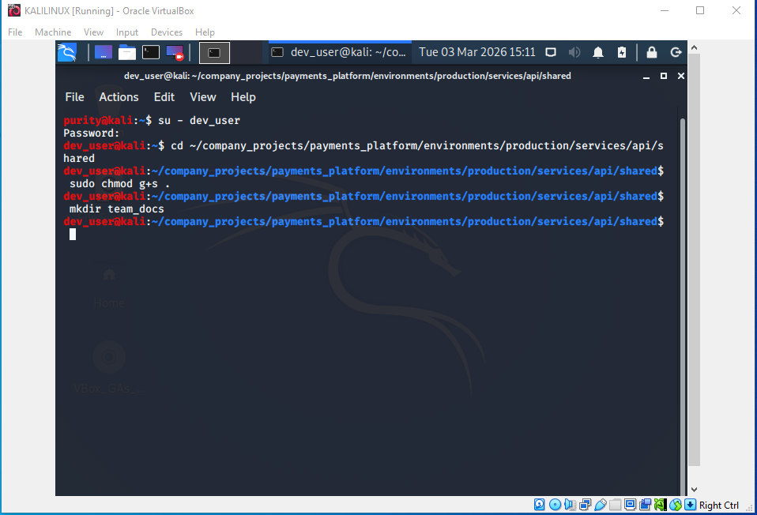

As intern_a, I create a file and folder inside team_docs:

cd /home/dev_user/company_projects/payments_platform/environments/production/services/api/shared/team_docs

touch notes.txt

mkdir drafts

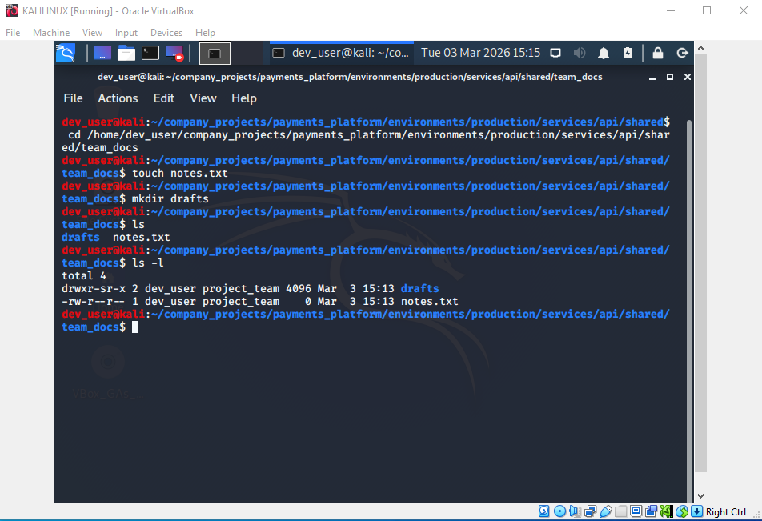

4. Verify that all newly created files and folders inherit the parent group (project_team) instead of the creating user’s primary group.

ls –l

All files/folders have group project_team even though intern_a’s primary group is different.

I see that setgid on a directory forces all new files and subdirectories to inherit the parent directory’s group, which is important for team collaboration.

Task C – SetUID on Files

1. Inside

~/company_projects/payments_platform/environments/production/services/api/bin/, create a dummy file named run_task.sh.	

2. Apply setuid on the file in both symbolic modes:

○ s (executable with owner’s privilege bit set)

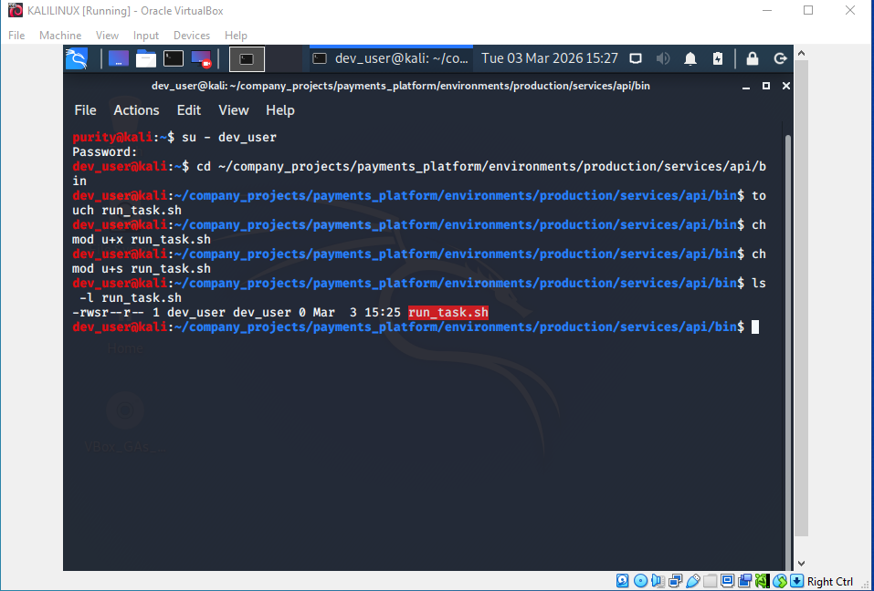

In the bin directory

cd ~/company_projects/payments_platform/environments/production/services/api/bin

Explanation: I go to the bin folder where I will create the dummy script for this exercise.

create a dummy file

touch run_task.sh

Explanation: I created an empty file. I don’t need to write anything inside it; I just want to observe permission bits.

Set setuid with execute for owner (‘s’)

Make the file executable for the owner

chmod u+x run_task.sh

Apply setuid

chmod u+s run_task.sh

Check the permissions

ls -l run_task.sh

The lowercase s shows setuid is active, and the owner can execute the file.

This means if someone executes the file, it will run with the owner’s privileges (dev_user)

○ S (executable with owner’s privilege bit set, but without execute for owner)

Remove owner execute and set setuid bit

chmod 4000 run_task.sh

Check the permissions

ls -l run_task.sh

•	The uppercase S means setuid is set, but the owner cannot execute the file yet.

•	This shows the difference:

o	s → setuid active and executable

o	S → setuid bit set but no execution

This is exactly what the assignment wants to observe without running the file.

2.	Do NOT run the file — the goal is to observe and understand permission bits.

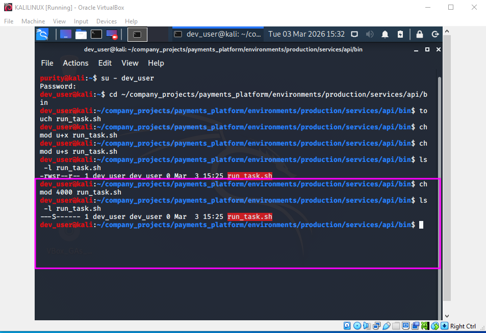

**Scenario 9 – Process Anomaly Investigation**

**Context**

System slowdown reported.

**Tasks**

1.	Run a Simulated Rogue Process

Start a process in the background

bash -c "while true; do :; done" &

•	This just runs an infinite loop.

•	The & puts it in the background.

2. Identify using ps, top/htop

ps aux | grep bash

Look for the process with while true.

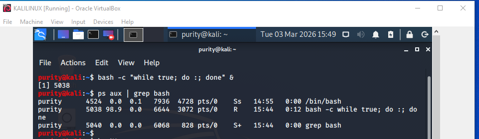

3.	Control Processes Using bg and fg

Check jobs :jobs

Bring it to the foreground (optional)

fg %1

Pause it and send back to background

Ctrl+Z   # pause

bg %1    

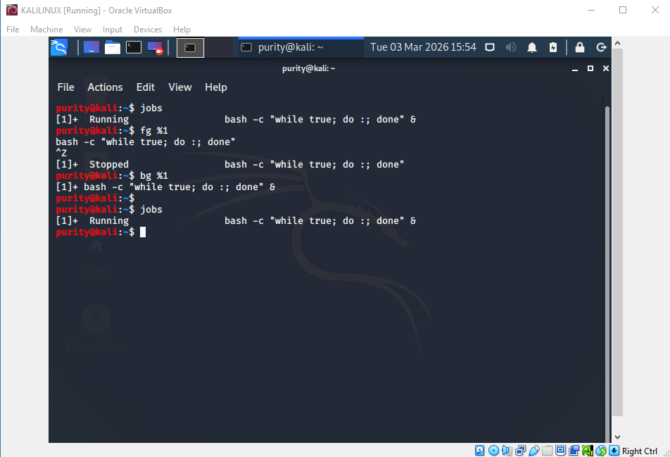

4. Terminate safely (kill)

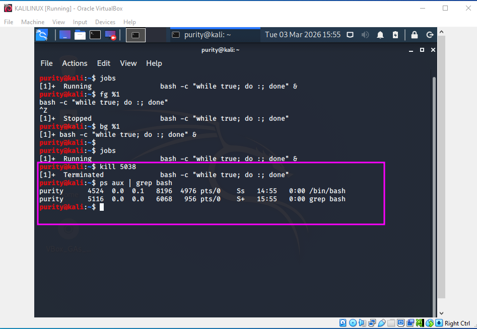

**Scenario 10 – Incident Documentation via Heredoc**

**Task**

● Generate incident_report.txt using heredoc

● Include:

○ Incident summaries

○ Findings

○ Commands executed

○ Preventative controls

I can create a file and write multiple lines at once using heredoc:

I use cat << EOF > filename to write many lines at once.

I type everything I want between << EOF and EOF.

The file incident_report.txt is created automatically.

I use cat to read and verify the report.

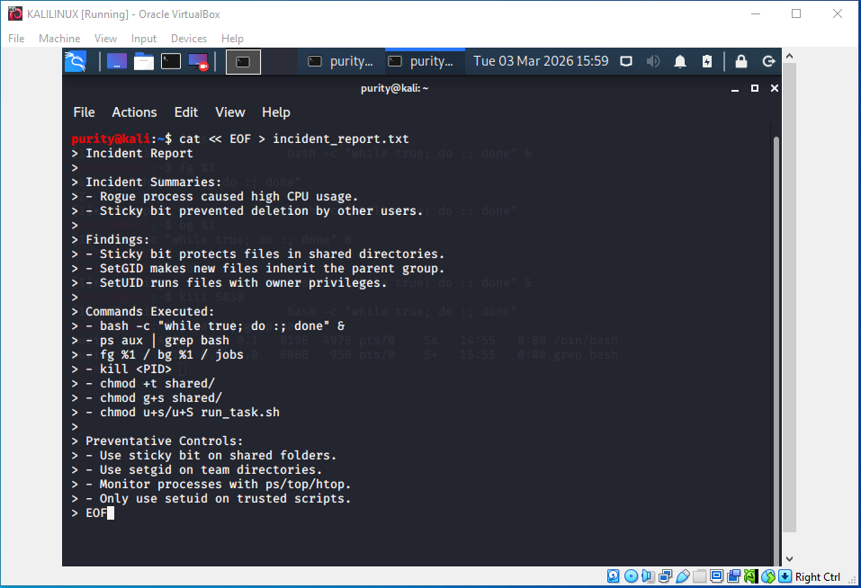

**CONCLUSION**

Through these scenarios, I deepened my understanding of Linux permissions, file system attributes, special permission bits, log protection, and process management. I learned that effective system hardening goes beyond basic permissions, requiring layered controls and forensic awareness. This lab enhanced my practical skills in troubleshooting, securing systems, and professionally documenting incidents.

